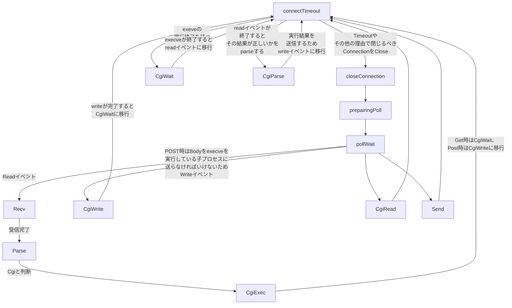

```mermaid
flowchart TD
connectTimeout-->|Timeoutや
その他の理由で閉じるべき
ConnectionをClose|closeConnection-->prepairingPoll-->pollWait-->|Readイベント|Recv-->|受信完了|Parse-->|Cgiと判断|CgiExec-->|Get時はCgiWait、
Post時はCgiWriteに移行|connectTimeout
connectTimeout-->|exeveの
実行終了を待つ|CgiWait-->|execveが終了すると
readイベントに移行|connectTimeout
pollWait-->|POST時はBodyをexecveを
実行している子プロセスに
送らなければいけないため
Writeイベント|CgiWrite-->|writeが完了すると
CgiWaitに移行|connectTimeout
pollWait-->CgiRead-->connectTimeout
connectTimeout-->|readイベントが
終了すると
その結果が正しいかを
parseする|CgiParse-->|実行結果を
送信するため
writeイベントに移行|connectTimeout
pollWait-->Send-->connectTimeout
```