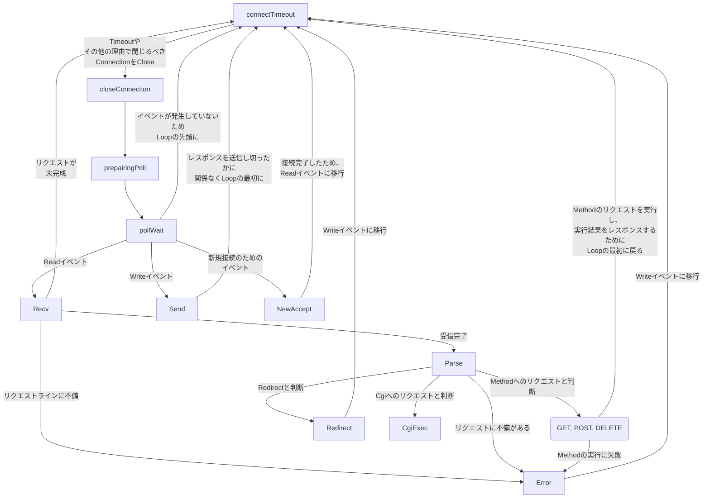

```mermaid
flowchart TD
connectTimeout-->|Timeoutや
その他の理由で閉じるべき
ConnectionをClose|closeConnection-->prepairingPoll-->pollWait-->|Readイベント|Recv-->|受信完了|Parse-->|Methodへのリクエストと判断|Method(GET, POST, DELETE)-->|Methodのリクエストを実行し、
実行結果をレスポンスするために
Loopの最初に戻る|connectTimeout
Parse-->|Redirectと判断|Redirect-->|Writeイベントに移行|connectTimeout
Parse-->|Cgiへのリクエストと判断|CgiExec
pollWait-->|Writeイベント|Send-->|レスポンスを送信し切ったかに
関係なくLoopの最初に|connectTimeout
Recv-->|リクエストが
未完成|connectTimeout
pollWait-->|新規接続のための
イベント|NewAccept-->|接続完了したため、
Readイベントに移行|connectTimeout
Recv-->|リクエストラインに不備|Error-->|Writeイベントに移行|connectTimeout
Parse-->|リクエストに不備がある|Error
Method-->|Methodの実行に失敗|Error
pollWait-->|イベントが発生していないため
Loopの先頭に|connectTimeout
```